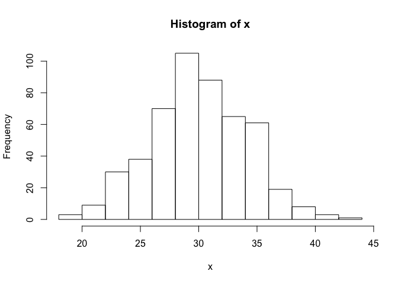

Data Visualization with OpenCPU
===============================

<!-- ##### Columbia University - STAT 5702 -->
<!-- ##### 2019 EDAV Community Contribution -->
Introduction
------------

### What is OpenCPU?

[OpenCPU](https://www.opencpu.org/) is a “API for Embedded Scientific
Computing.” OpenCPU consits of 3 main parts:

-   a server to host OpenCPU apps locally or on the cloud,
-   a HTTP API for data analysis using R, and
-   a JavaScript library to integrate everything together.

OpenCPU works as a platform to create web apps centered around using R
for any needed data analysis and visualizations.

### What is this Tutorial?

There is not a whole lot of information out there having to do with
actually creating an OpenCPU app, so this tutorial will attempt to piece
what information is available together by working through an example
project. There are 4 major steps involved:

-   [Creating a Disfunctional App](#creating-a-disfunctional-app):
    creating an R package to acomplish the data processing we need and
    the HTML for the user to interact with,
-   [OpenCPU.js](#opencpu.js): connecting the HTML to the R package with
    the OpenCPU JavaScript library,
-   [Local Development](#opencpu-in-rstudio): testing the app locally,
    and
-   [App Deployment](app-deployment): deploying the app to the OpenCPU
    Cloud.

> As a note, when you see text in brackets around text, that is intended
> to be completly replaced. For example: \[package\_name\] *becomes*
> distogram.

As mentioned, this tutorial will be centered around an example… enter
Distogram.

### Distogram: A Working OpenCPU Example

I wanted to keep things relatively simple, but I think this example gets
the point across of the power of using R in the browser. Distogram is an
app that prompts users to choose a sample size and probability
distribution to sample from, uses R to create a histogram based on these
and other parameters, and then presents that plot in the browser. Later
I will go through the steps of sourcing this app locally if you chose to
do that, but for now, if you want an idea of where this will work
towards, please visit
<a href="https://mbmackenzie.ocpu.io/distogram" target="_blank">mbmackenzie/distogram</a>
to view this project.

Creating a Disfunctional App
----------------------------

The first step in creating an OpenCPU app is to fist create an app that
does not work. What I mean by this is to build all the R, HTML, CSS, and
some JavaScript. While I will not go through all the bits of this since
the main point is OpenCPU, all the code is on github
[here](https://github.com/mbmackenzie/distogram).

The file structure of this dysfunctional app will be something like
this.

``` bash
.
├── DESCRIPTION
├── LICENSE
├── NAMESPACE
├── R
│   └── script.R
├── README.md
├── inst
│   └── www
│       ├── script
│       ├── index.html
│       └── style.css
└── man
    └── script.Rd
```

### Standalone Package

OpenCPU apps require a build-able R package specific to the app. For
completeness on building a package in R, I’d point you to this resource:
[R packages](http://r-pkgs.had.co.nz/). However, I will go through what
seems to be the minimum for OpenCPU.

#### DESCRIPTION

The DESCRIPTION file stores important metadata about the package such as
name, author, description, version, etc… Below is a template for
creating a DESCRIPTION file.

    Package: [package_name]
    Type: Package
    Title: [title]
    Version: [x.x.x]
    Date: [YYYY-MM-DD]
    Author: [author_name]
    Maintainer: [maintainer_name] <[maintainer_email]>
    Description: [Description]
    License: MIT
    RoxygenNote: 6.1.1

#### /R

The `/R` directory is responsible for holding the R code for the
package. Naming of the files does not matter here, as we will just be
referring to the names of functions. Anything that you need the app to
do should be put into functions that accept whatever arguments
necessary. Remember, this is a standalone package in R, so write your
code as if you were not just doing this for a web app.

To start off the Distogram example, I will briefly go over the purpose
and little bit of code in this example. As stated above, the example is
an app to plot different distributions with a varying number of samples.
So from this, I needed a function that takes in as arguments:

-   Number of samples
-   Name of distribution
-   Any parameters for that distribution
-   (though not necessary) a boolean to indicate whether a kde should be
    drawn aswell

The gist of the code looks like this:

``` r
plotdist <- function(n, dist, ..., kde = FALSE) {
  # extract params from ... args
  r_params <- c(list(...), list(n = n))
  
  # if norm, do this... 
  # in the actual code there are other cases too
  if (dist == 'norm') {
    if (is.null(r_params$mean)) r_params$mean <- 0
    if (is.null(r_params$sd)) r_params$sd <- 1
    funcs = list(r = rnorm, d = dnorm)
  }

  # sample from desired distribution
  x <- do.call(funcs$r, r_params)
  
  # return the histogram
  hist(x)
}
```

And the output would look like this for a normal distribution:

``` r
plotdist(500, 'norm', mean = 30, sd = 4)
```



#### /man and NAMESPACE

the `man` folder contains documentaion in `*.Rd` files, and NAMESPACE
contains, basically, how the package will interact with other packages.
Luckily(!), if you use `devtools`, you dont have to do anything but tell
devtools to do this part. To do this fist install `devtools` and
`roxygen2`…

##### CRAN:

``` r
install.packages("devtools")
install.packages("roxygen2")
```

##### conda:

``` bash
conda install -c conda-forge r-devtools
conda install -c r r-roxygen2
```

Next, to actually generate the documention, be in the directory of the
package, and simply run:

``` r
devtools::document()
```

#### /inst/www

This is where any HTML, CSS, and JavaScript that make up the web page
for the application will go. This is not a tutorial for building
webpages, and later I will go over certain script tags you need in order
for OpenCPU to work, but there are a few important things to be included
here.

##### HTML

When you are designing the web page, you should create a `div` element
with the id “plotdiv.” This will be where the plots created in R are
rendered in the browser.

``` html
<div id="plotdiv"></div>
```

Moving along with the example, I used bootstrap for creating the web
page. The necessary tags for bootstrap are are something like the
following:

``` html
<link rel="stylesheet" href="https://stackpath.bootstrapcdn.com/bootstrap/4.3.1/css/bootstrap.min.css">
<script src="https://stackpath.bootstrapcdn.com/bootstrap/4.3.1/js/bootstrap.min.js"></script>
```

For completeness on bootstap, vist
<https://getbootstrap.com/docs/4.3/getting-started/introduction/> as
this will have tags for the most updated versions as well as anything
else you might need. For example, JQuery is also needed here, but as it
will be adressed later I am omitting it for now. All of the HTML code is
in the file index.html on github.

##### JavaScript

A good place to start with the JavaScript is to create a file
*script.js* and in it put the following:

``` javascript
$(function () {
    $("#plotdiv").resizable()
  
    // CODE
}
```

The interactivity of the page is done with JavaScript. Since OpenCPU.js
is built on JQuery, that is the library I reccomend using for
interacting. All other JavaScript code is put inside this function where
the `// CODE` is.

In distogram, my main challege was how do I send different parameters to
R for each distribution with only a single generic function to handle
these calls. I settled on using buttons to trigger events, and I created
the function `doClick` that handled what happened with a button is
clicked.

``` javascript
function doClick(event) {
    Object.entries(event.data).forEach(([key, value]) => {
        if (value.startsWith("getParamValue")) {
            params[key] = getParamValue(value.split("-")[1]);
        } else {
            params[key] = value
        }
    });
    console.log(params)
    // runR(params);
};
```

The above basically takes in a list of parameters, then creates a new
object filled with parameters to send to R. The function `runR` will be
discussed later, so in this standalone version the parameters are logged
and `runR` is commented out. I settled on a convention for parameters
that I needed to obtain through JQuery, where basically if I was sending
a parameter that was adjustable, the string `getParamValue-<id>` was
sent. From here, I could get whatever values I needed. To make this
clear, below is the code that binds the uniform distribution button and
`doClick` event.

``` javascript
$("#unifbtn").on('click', {
    dist: "unif",
    name: "Uniform",
    min: "getParamValue-unifmin",
    max: "getParamValue-unifmax"
}, doClick)
```

Since the min and max values are parameters that the user can change,
when the button is clicked, the current values set by the user are sent
to R.

##### CSS

Please see the code on github for this part. Any suggestions to this
part are most welcome, as CSS is a particular weak point for me.

opencpu.js
----------

By this point, the hope is that you can make calls in RStudio to
whatever functions you have created and you can open your index.html
file in a web browser and play around with it. It should feel as if the
app is functional, but instead of any R code running, any intended
parameters to be sent to R are instead printed to the javascript
console.

> To open the JavaScript console in Google Chrome: View → Developer →
> JavaScript Console

In order for OpenCPU to run your R code we need two things.

1.  The necessary script tags
2.  A call to `rplot`

### Adding the opencpu.js Library

First things first, the script tags that make everything work are the
following.

``` html
<script src="https://code.jquery.com/jquery-1.11.1.min.js"></script>
<script src="https://cdn.opencpu.org/opencpu-0.4.js"></script>
<script src="https://code.jquery.com/ui/1.12.0/jquery-ui.min.js"></script>
```

As versioning changes, consult <https://www.opencpu.org/jslib.html> for
the most recent stable libraries. The first two tags are absolutely
necessary, the third is not… unless you started with the code
reccomended in the JavaScript section, as `.resizable` is a part of
jquery-ui.js. I should mention that OpenCPU reccomends downloading the
js files and storing them in the project directly, and you should do
this if you do not want to deal with constantly changing libraries and
compatability problems. (…I did not do this in distogram)

What the above does in terms of OpenCPU is allow us to use the function
`rplot`.

### The OpenCPU Library

There are two key functions in the opencpu.js API, `rplot` and `rpc`.
These have different functions but both utilize R for the heavy lifting.
These functions use HTTP requests to interact with R, and because of
this error handling is important. Things will naturally break and
require debugging, so here is a handy thing to do when using these
functions.

``` javascript
let req = <some_opencpu_function>
req.fail(function () {
    alert("HTTP error " + req.status + ": " + req.responseText);
});
```

If you add the `.fail` part, you will have a better idea of what went
wrong when it does go wrong. When I get to the distogram example, you
will see this in action, though in a slightly different flavor.

#### rplot

`rplot` is the the function to generate an R plot in a div. This
function takes 2 main arguments, the name of the function to call, and
the parameters to call that function with. Though parameters are not
required, most cituations will need some type of parameterization.

``` javascript
$("#plotdiv").rplot( fun, [, args ] [, callback ])
```

-   `fun` is the function name.
-   `args` is an object with the parameter names as the object keys and
    the parameter values as the object values.
-   `callback` is optional.

#### rpc

`rpc` is the OpenCPU “data processing unit”. If you wanted to run a
function that returns a character output to the browser, use this.
Distogram does not utilize this function, but the `runR` function above
could be modified easily to utilize this.

``` javascript
ocpu.rpc( fun, [, args ] [, complete ] )
```

-   `fun` is the function name.
-   `args` is an object (see above).
-   `complete` is a callback called only on success with one arg: output
    (R return value)

The caveat with `rpc` is using the call back to obtain the output. As an
example, say you wanted to compute the standard deviation of a list of
values, call it `myData`. You could use the function `sd` in R to
compute the standard deviation.

``` javascript
var req = ocpu.rpc("sd", {
    x: mydata
}, function(output){
    console.log("Standard Deviation equals: " + output);
});
```

### distogram.js::runR

My method of utilizing `rplot` in distogram is this following function:

``` javascript
function runR(params) {
    let req = $("#plotdiv").rplot("plotdist", params).fail(function () {
        alert("HTTP error " + req.status + ": " + req.responseText);
    });
}
```

Above the previous section where I went through some of the JavaScript
code, this function is called in `doClick`, and will send all the
necessary parameters to R, create a plot, and then return that plot to
the div with id “plotdiv”.

Local Development
-----------------

OpenCPU apps run on a specific server for their HTTP API to work
correctly. So, OpenCPU provides two ways to deploy these apps. The first
is a locally run server using the OpenCPU R package.

##### CRAN:

``` r
install.packages("opencpu")
```

##### conda:

``` bash
conda install -c conda-forge r-opencpu
```

Once installed, this packages offers functions to launch your own apps
for development purposes or launch already made apps locally. This
section will focus on the former, and at the end I will discuss the
second possibility.

### Building your Standalone Package

Building a package is very easy with devtools, and since in previous
sections created a properly build-able package, this part should be
easy. Run the following commands inside the directory of the package.

``` r
library(devtools)
build()
install()

library([package_name])
```

### Starting the Server

OpenCPU provides a function to point to a package and start the server.

``` r
ocpu_start_app("[package_name]", no_cache = TRUE)
```

When you run this line, a new local host instance of your app will
start, and in my experience open in a new browser. One major issure I
ran into, the solution to which alluded me for some time, is that I
would rebuild my project after updating the HTML, re run the server, and
nothing would change. Thi is where `no_cache = TRUE` comes into play.
What was happening was google chrome (my browser of choice) had chached
the html, and was not reloading my changes. To fix this, silmpy clearing
the cache in chrome worked, and also adding this argument helped to. I
found this chrome extension, [Clean
Guru](https://chrome.google.com/webstore/detail/clean-guru-cache-history/njjijbcogjkninkeeobbbkcbiblpjafa?hl=en-US)
that worked very well for me to quickly clear the cache.

App Deployment
--------------

At this point, the app can be deployed locally without any hassle, but
this is pretty meaningless for displaying your work to the world. This
is where the last impressive part of OpenCPU comes into play, the
OpenCPU Cloud. Dealing with deploying apps to cloud based solutions can
be very complicated, however, the method OpenCPU uses is by far my
favorite. It uses github webhooks to deploy your app. What this means,
is that every time you push your code to github (which implies you must
use github) OpenCPU will attempt to build your app. If it is successful,
the app will be hosted directly on their servers, and you can access it
easily with a simple url.

### Adding the Webhook

In your github project, go to Settings, Webhooks, and click ‘Add
Webhook.’

-   Set **Payload URL** to *<https://cloud.opencpu.org/ocpu/webhook>*.
-   Set **Content Type** to *application/json*.

And finally click ‘Add Webhook’ at the bottom of the page. In a matter
of seconds to minutes, so long as everything builds properly, your app
will be hosted at
“<https://%5Byour_github_username%5D.ocpu.io/%5Bgithub_project_name%5D>”.
